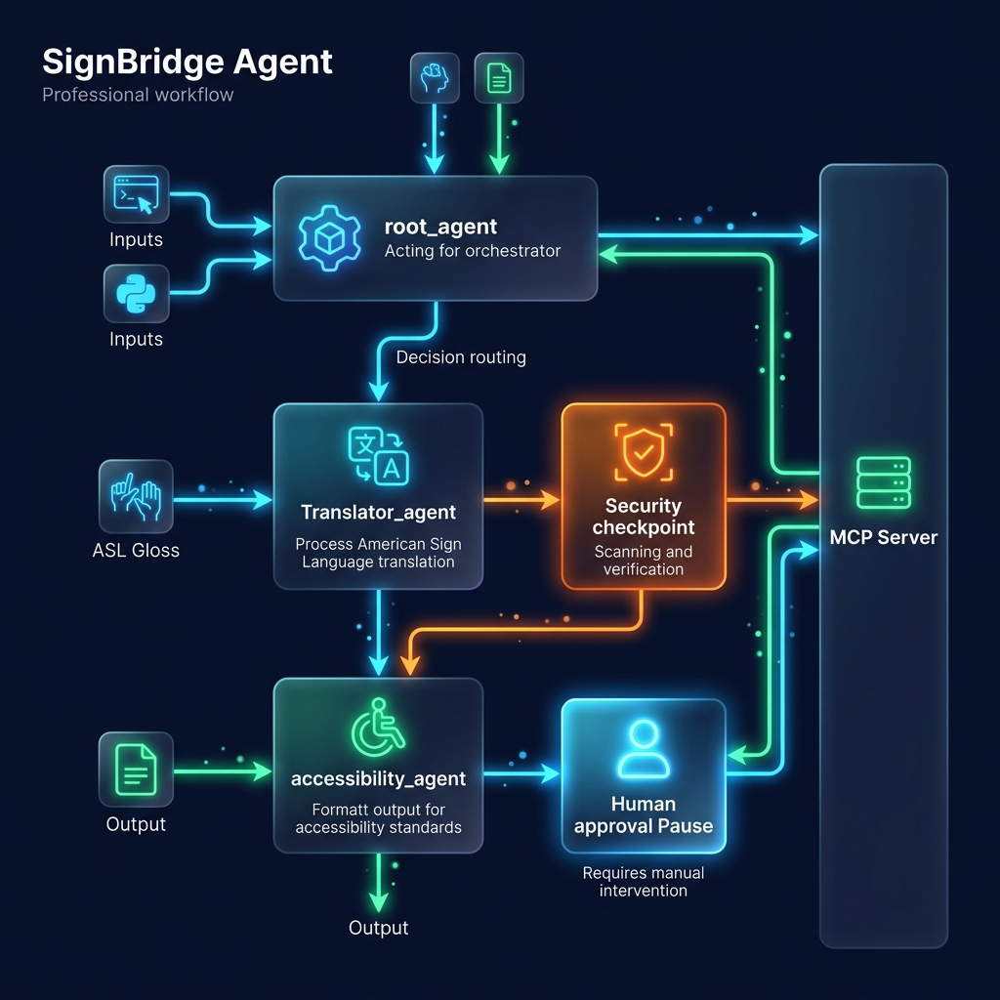
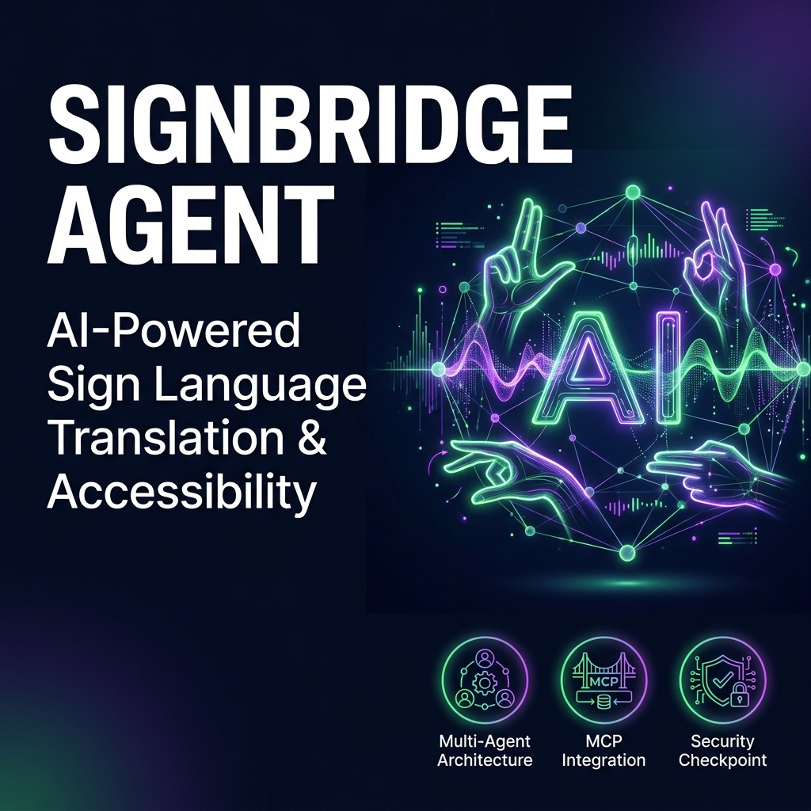

# SignBridge Agent 🤟

**An Intelligent ADK Multi-Agent System for Sign Language Translation, ASL Syntax Verification, and Accessible Communication.**

---

## 📌 Overview

SignBridge Agent bridges the communication gap between Deaf/Hard-of-Hearing individuals and hearing communities. Built on Google Agent Development Kit (ADK 2.0), it orchestrates translation between Spoken English and ASL Gloss notations, checks grammar structure (Topic-Comment), formats accessible captions for specialized display devices, and enforces security and human-in-the-loop controls.

---

## 🛠️ Prerequisites

Before starting, ensure you have installed:
- **Python**: 3.11 or higher
- **uv**: Fast Python package manager (`powershell -ExecutionPolicy ByPass -c "irm https://astral.sh/uv/install.ps1 | iex"`)
- **Gemini API Key**: Get a free key at [Google AI Studio](https://aistudio.google.com/apikey)

---

## 🚀 Quick Start

1. **Clone & Navigate:**
   ```bash
   git clone <your-repo-url>
   cd signbridge-agent
   ```

2. **Configure Environment:**
   Create a `.env` file in the project root:
   ```env
   GOOGLE_API_KEY=your_gemini_api_key_here
   GOOGLE_GENAI_USE_VERTEXAI=False
   GEMINI_MODEL=gemini-2.5-flash
   ```

3. **Install Dependencies:**
   ```bash
   make install
   ```

4. **Launch Local Playground UI:**
   ```bash
   make playground
   ```
   Open your browser to `http://localhost:18081` to test the agent interactively.

---

## 🏗️ Architecture

```
                       +------------------------+
                       |   User Request Input   |
                       +-----------+------------+
                                   |
                                   v
                       +------------------------+
                       |  Security Checkpoint   |
                       | (PII Scrub & Injection)|
                       +-----------+------------+
                                   |
                                   v
                       +------------------------+
                       |   Root Orchestrator    |
                       |       (LlmAgent)       |
                       +-----+------------+-----+
                             |            |
             +---------------+            +---------------+
             |                                            |
             v                                            v
+------------------------+                    +------------------------+
|   translator_agent     |                    |  accessibility_agent   |
|   (ASL Gloss & Syntax) |                    |  (Captions & Formatting|
+-----------+------------+                    +-----------+------------+
            |                                             |
            +----------------------+----------------------+
                                   |
                                   v
                       +------------------------+
                       |    SignBridge MCP      |
                       |  (Dictionary & Tools)  |
                       +------------------------+
```

---

## 🧪 Sample Test Cases

Try these test queries in the local playground UI:

### Test Case 1: Sign Dictionary & Gloss Translation
- **Input:** `"Translate 'hello, can you help me find a doctor?' into ASL gloss and check the handshapes."`
- **Expected Output:** The orchestrator delegates to `translator_agent`, which calls the MCP dictionary tool and grammar checker to return structured ASL gloss (`HELLO HELP ME FIND DOCTOR?`) and handshape descriptions.

### Test Case 2: Accessibility Device Formatting
- **Input:** `"Format the message 'Emergency Assistance Required' for a high-contrast visual display device."`
- **Expected Output:** The orchestrator delegates to `accessibility_agent`, invoking `accessibility_formatter` with `high_contrast` mode.

### Test Case 3: Security & PII Scrubbing Audit
- **Input:** `"Translate 'Please call doctor smith at 555-0199 or email test@example.com immediately.'"`
- **Expected Output:** The `security_checkpoint` sanitizes the phone number and email address to `[REDACTED_PHONE]` and `[REDACTED_EMAIL]`, logging a structured audit warning while safely executing the translation request.

---

## 🎨 Assets

**Architecture Diagram:**

   
**Project Cover Banner:**

   
---

## 🎬 Demo Script

Refer to `DEMO_SCRIPT.txt` for a step-by-step spoken presentation script timed for 3–4 minutes.

---

## 🔧 Troubleshooting

1. **429 Resource Exhausted / Quota Exceeded:**
   - Switch `GEMINI_MODEL` in `.env` to `gemini-2.5-flash-lite` for higher daily limits.
2. **MCP Server Connection Failure:**
   - Ensure `uv` is on system PATH so subprocess spawned by `McpToolset` can execute `app.mcp_server`.
3. **Windows Server Code Changes Not Reflecting:**
   - Stop the running server (`Stop-Process`) and relaunch `make playground` to clear cached Python code.

---

## 📤 Push to GitHub

1. Create a new repository at [GitHub New Repo](https://github.com/new) (Name: `signbridge-agent`).
2. In your terminal, run:
   ```bash
   cd signbridge-agent
   git init
   git add .
   git commit -m "Initial commit: SignBridge Agent ADK project"
   git branch -M main
   git remote add origin https://github.com/Devadharsha-K/signbridge-agent.git
   git push -u origin main
   ```
⚠️ **NEVER commit your `.env` file containing your API key!**
